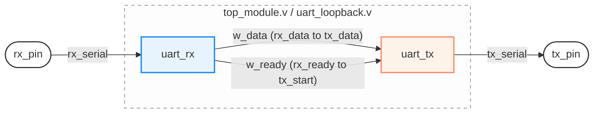

**Overview**

A UART (Universal Asynchronous Receiver-Transmitter) *loopback system* designed in verilog. This acts as a *hardware validation test*. This system receives Serial data at 115,200 baud, converts it to parallel data, and immediately echoes it back via the transmitter.

### Clock-to-Baud Math

| Step | Calculation | Result |
|---|---|---|
| FPGA clock | — | 50 MHz (50,000,000 cycles/sec) |
| Target baud rate | — | 115,200 bits/sec |
| TX: clocks per bit period | 50,000,000 / 115,200 | ≈ 434 → `TX_CLK_LIMIT` |
| RX: clocks per oversample tick | 434 / 16 | ≈ 27 → `RX_CLK_LIMIT` |

> **Note:** 434/16 = 27.125, not a whole number — `RX_CLK_LIMIT` is rounded to 27. This introduces a small timing drift (~7 clocks accumulated by the last data bit), which is tolerated because RX samples at the midpoint of each bit, giving enough margin to absorb it.

### Parameters

| Parameter | Module | Value | Meaning |
|---|---|---|---|
| `TX_CLK_LIMIT` | `uart_tx` | 434 | Number of `clk` cycles per bit period (generates `bit_tick`) |
| `RX_CLK_LIMIT` | `uart_rx` | 27 | Number of `clk` cycles per oversample tick (generates `sample_tick`, 16 per bit period) |
| Clock frequency | both | 50 MHz | System clock driving both modules |
| Baud rate | both | 115,200 bps | Target serial communication speed |
| Oversampling factor | `uart_rx` | 16× | Number of `sample_tick` pulses per bit period, used to locate the midpoint of each bit |

> These parameters are tied together: retargeting this design to a different clock frequency or baud rate means recalculating both `TX_CLK_LIMIT` (`clk_freq / baud_rate`) and `RX_CLK_LIMIT` (`TX_CLK_LIMIT / 16`).

### Transmitter (`uart_tx`)

**Trigger:** Transmission starts when `tx_start` is asserted while the FSM is in `STATE_IDLE`. On this trigger, the byte to send (`tx_data`) is latched into an internal holding register (`tx_data_reg`), `bit_index` is reset to 0, and the FSM moves to `STATE_START`.

**States:**
- `STATE_IDLE`: `tx_serial` is held high (idle line). The FSM waits here until `tx_start` is asserted.
- `STATE_START`: `tx_serial` is driven low (the start bit). The FSM waits for one full bit period (`bit_tick`) before moving to `STATE_DATA`.
- `STATE_DATA`: `tx_serial` outputs `tx_data_reg[bit_index]` — the current bit being sent. On every `bit_tick`, `bit_index` increments, until all 8 bits (index 0–7) have been sent, at which point the FSM moves to `STATE_STOP`.
- `STATE_STOP`: `tx_serial` is driven high (the stop bit). After one more `bit_tick`, the FSM returns to `STATE_IDLE`, ready for the next byte.

**Timing:** `bit_tick` is a pulse generated once every `TX_CLK_LIMIT` (434) clock cycles — i.e., once per bit period at 115200 baud. Since TX is the source of the signal it's generating, it doesn't need to measure or interpret anything external — `bit_tick` firing is simply "time to move to the next bit/state," and the FSM advances directly on that pulse.

**`tx_busy`:** Asserted whenever the FSM is in `STATE_START`, `STATE_DATA`, or `STATE_STOP` — i.e., whenever a transmission is actively in progress, letting external logic know not to assert `tx_start` again until the current byte finishes.

### Receiver (`uart_rx`)

Here you go — matching style:

Receiver (uart_rx)

Trigger: Unlike the transmitter, the receiver has no advance notice that a byte is coming — it continuously watches rx_serial while in STATE_IDLE. The instant the line drops low, it resets tick_count to 0 and moves to STATE_START. This check is combinational, not gated by sample_tick, so the FSM reacts on the very cycle the line goes low.

Timing: sample_tick is generated once every RX_CLK_LIMIT (27) clock cycles — 16 times faster than the actual bit period. This oversampling exists because RX has no external timing reference like TX does; it has to discover bit boundaries purely from the position of the falling start edge, then count ticks from there. Sampling at the midpoint of each bit (rather than right at an edge) gives the maximum possible tolerance to clock drift or baud-rate mismatch between TX and RX.

States:

STATE_IDLE: Watches rx_serial directly. On a falling edge, resets tick_count and moves to STATE_START.
STATE_START: Counts sample_ticks up to tick_count == 7 — the halfway point of the bit period. At that point it re-checks the line: if rx_serial is still low, this confirms a genuine start bit (not just noise), tick_count resets, bit_index resets, and the FSM moves to STATE_DATA. If the line has gone back high, it was a glitch — the FSM returns to STATE_IDLE without ever entering STATE_DATA. This mid-bit recheck is a deliberate glitch filter.
STATE_DATA: For each of the 8 data bits, counts a full 16 sample_ticks. At tick_count == 15 — the midpoint of that bit — it samples rx_serial into rx_data_reg[bit_index]. After bit index 7 is sampled, the FSM moves to STATE_STOP; otherwise it increments bit_index and repeats for the next bit.
STATE_STOP: Counts a full 16 sample_ticks, then samples the line one last time. If rx_serial is high (a valid stop bit), the assembled byte is latched into rx_data and rx_ready is pulsed high for exactly one clock cycle. If rx_serial is low, this is a framing error — the byte is silently discarded, with no error flag raised. Either way, the FSM returns to STATE_IDLE.

rx_ready: Defaulted to 0 at the start of every clock cycle, then set to 1 only in the successful branch of STATE_STOP — the standard "default-then-override" pattern that guarantees a clean, exactly-one-cycle pulse without needing a separate clear mechanism.

Known limitation: There is no framing-error output and no input synchronizer on rx_serial — an asynchronous external signal is used directly by the FSM with no 2-flop synchronizer stage, so metastability isn't guarded against in this design.

**Testbench (uart_tb)**

Purpose: A self-checking loopback testbench that instantiates both uart_tx and uart_rx, wiring rx_serial directly to tx_serial. It verifies that any byte sent out by the transmitter is correctly reconstructed by the receiver, without requiring manual waveform inspection.

Speeding up simulation: Rather than simulating the real baud-rate timing (434 cycles per bit for TX, 27 cycles per oversample tick for RX — which would make simulation painfully slow), the testbench overrides both timing parameters at instantiation: TX_CLK_LIMIT → 16 and RX_CLK_LIMIT → 1. This is a standard RTL verification technique — the timing constants are parameterized in the design specifically so tests can compress simulated time without touching any logic.

Self-checking task (send_and_check):

Waits for tx_busy to go low before doing anything — since uart_tx silently ignores tx_start while busy, the testbench has to explicitly avoid triggering that condition rather than relying on the DUT to handle it.
Drives tx_data with the test byte and pulses tx_start for one cycle.
Waits on the rx_ready pulse from the receiver.
Compares rx_data === test_byte and prints a PASS/FAIL message with the sent and received values.

Test vectors: 8'hA5, 8'h5A, 8'h55, 8'hFF — deliberately alternating bit patterns (10100101, 01011010, 01010101, 11111111) chosen to catch bit-ordering or off-by-one indexing bugs; an all-zero or single-bit test wouldn't expose a swapped-bit error the way these patterns would.

Waveform output: The testbench dumps all signals to uart_sim.vcd via $dumpfile/$dumpvars, so the full transaction can be inspected in GTKWave if a test fails or if you want to visually confirm oversampling behavior (e.g., seeing sample_tick fire 16 times per bit_tick).

Coverage gap: Because RX is only ever exercised via tx_serial in this testbench, this setup proves TX and RX are mutually consistent with each other, but it does not independently test RX's glitch-filtering or its tolerance to a mismatched baud rate — that would require driving rx_serial directly from a separate, deliberately imperfect stimulus generator.

​
